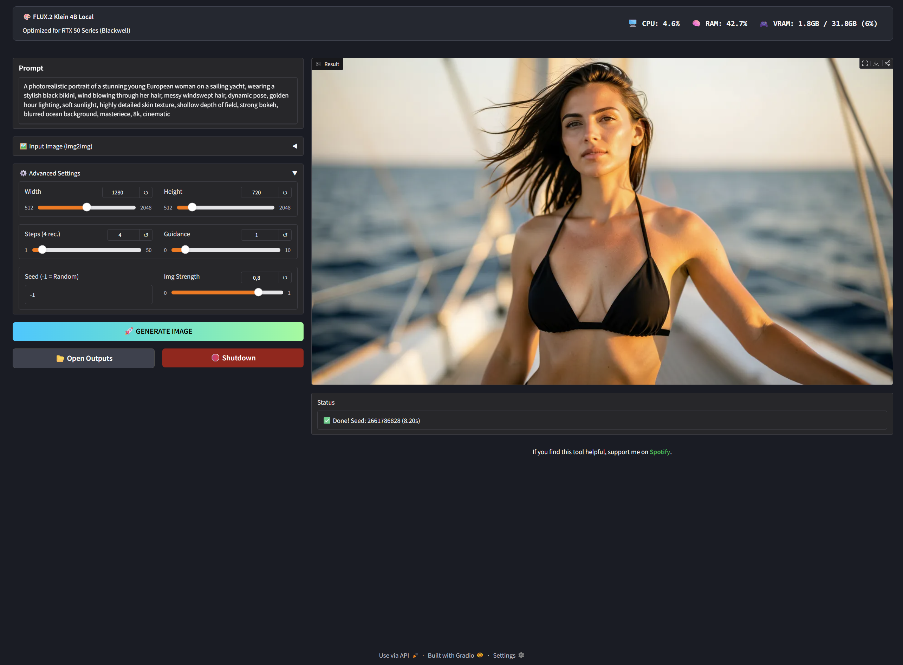
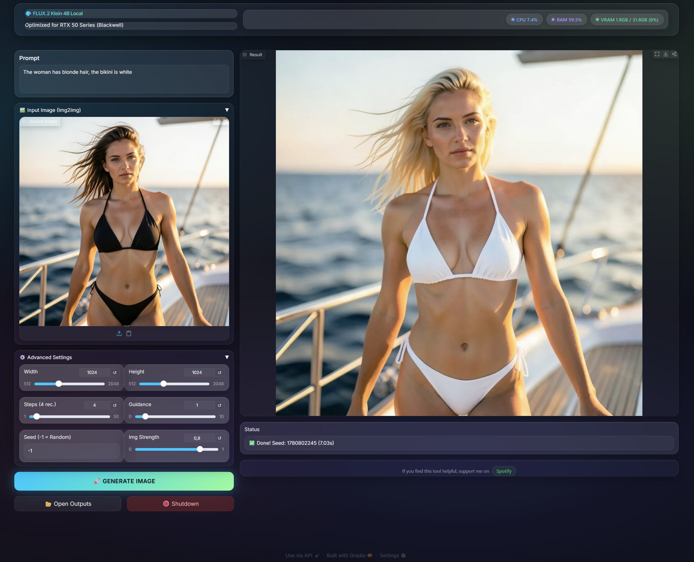

# ⚡ FLUX.2 Klein 4B Local GUI (RTX 50 Series Optimized)

A lightweight, high‑performance local interface for **FLUX.2 Klein (4B)** by Black Forest Labs.

This project is specifically optimized for **NVIDIA RTX 50 Series** GPUs, utilizing PyTorch Nightly (CUDA 13.0) and `bfloat16` precision for maximum speed.

| Screenshot 1 | Screenshot 2 |
|--------------|--------------|
|  |  |

## 🚀 Features

* **⚙️ Optimized for Blackwell** – Built on PyTorch Nightly with CUDA 13.0 support for RTX 50 Series.
* **⚡ Fast Generation** – Pre‑configured for the “Klein” model (only 4 steps required).
* **🔄 Dual Modes** – Supports **Text‑to‑Image** and **Image‑to‑Image**.
* **🧠 Memory Efficient** – Implements CPU offloading to manage the 4B parameter model effectively.
* **📦 One‑Click Installer** – Includes a robust batch script for easy setup on Windows.
* **📊 Live Hardware Monitor** – Real‑time dashboard to watch VRAM, RAM, and CPU usage while generating.
* **📂 Auto‑Save** – Automatically creates an `outputs` folder and saves every generation with a timestamp.
* **🛄 Portable** – Does not modify your Windows system. Everything stays contained in one folder.

## 📋 Prerequisites

* **OS** – Windows 10/11
* **GPU** – NVIDIA RTX 3090 / 4090 / 5090 (16GB+ VRAM recommended)

## 📥 Installation

1. Download this repository as a ZIP file and extract it.
2. Double‑click `install.bat`.
   * The script automatically downloads an isolated Python 3.11 environment.
   * It installs PyTorch Nightly (required for Blackwell / RTX 50 Series support).
3. Wait until the installation is complete.

## 🖥️ Usage

1. Double‑click `start_FLUX2‑KLEIN‑4B_gui.bat`.
2. Wait for the model to load (first run downloads approximately 16GB).
3. The GUI will open automatically in your browser (usually `http://127.0.0.1:7860`).

## ⚙️ Recommended Settings for Klein

The Klein model is distilled, meaning it behaves differently than the base model:

* **Steps** – 4 steps is the sweet spot.
* **Guidance Scale** – Leave at 1.0.
* **Resolution** – 1024×1024 works best.

## 🔧 Troubleshooting

* **OOM (Out of Memory)** – Ensure you don’t have other heavy GPU apps running. The app uses CPU offloading to save VRAM.

## 📄 License

This model is licensed under the [Apache License 2.0](https://www.apache.org/licenses/LICENSE‑2.0).  
The project code is provided under the same license.

## 🤝 Support

This is a free open‑source project. I don’t ask for donations.

However, if you want to say “Thanks”, check out my profile on [Spotify](https://open.spotify.com/artist/7EdK2cuIo7xTAacutHs9gv?si=4AqQE6GcQpKJFeVk6gJ06g).  
A follow or a listen is the best way to support me! 🎧

## 🔗 Credits
- **Model:** [FLUX.2-Klein-4B](https://huggingface.co/black-forest-labs/FLUX.2-klein-4B)
- **Library:** [Hugging Face Diffusers](https://github.com/huggingface/diffusers)
---

*If you encounter any issues, please open an issue on the GitHub repository.*
